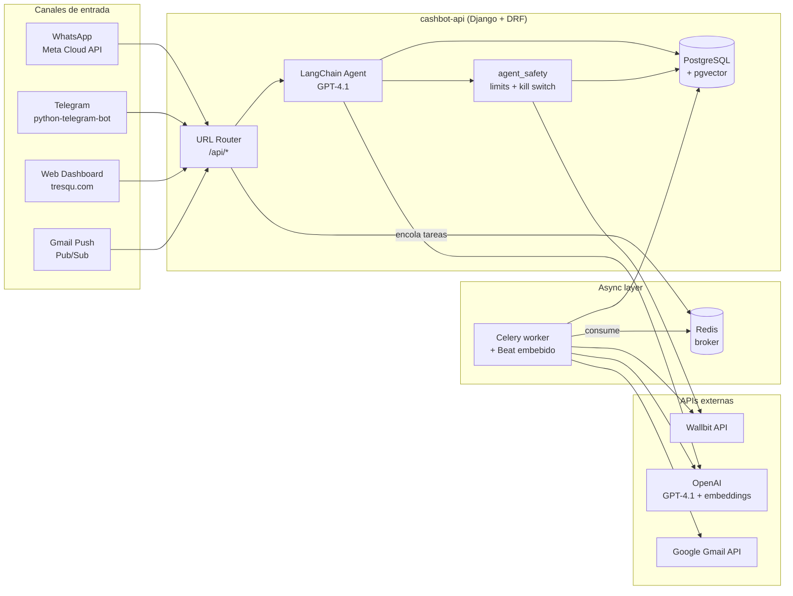
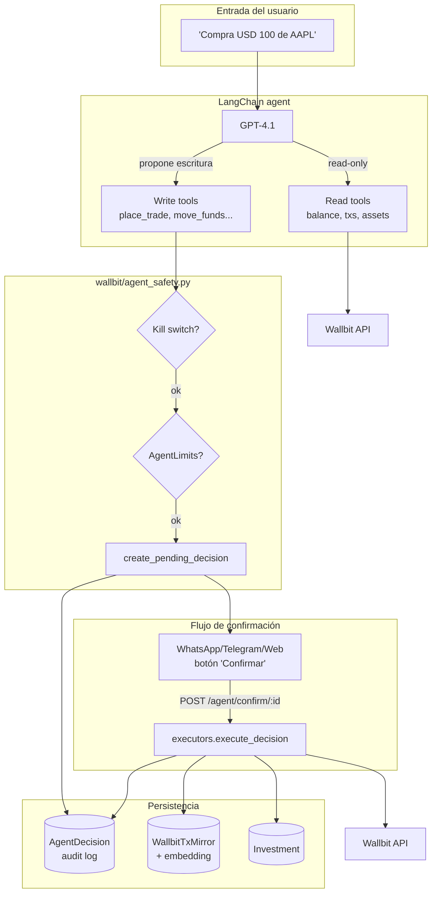
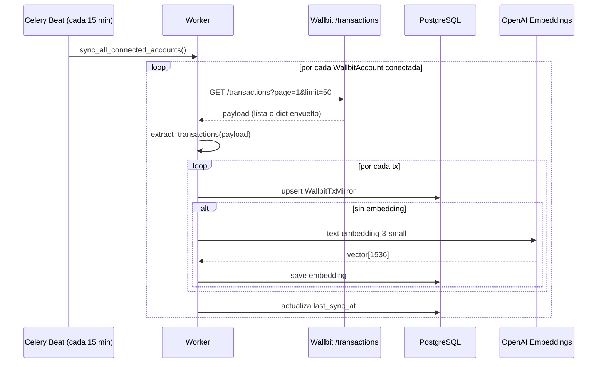

# Tresqu API

**Backend de gestión financiera personal con IA + integración Wallbit**

Django REST API para Tresqu. Combina gestión de gastos/ingresos, chatbots inteligentes (Telegram + WhatsApp), detección automática de compras vía Gmail, RAG con pgvector y — desde la última release — un **agente conversacional que opera sobre Wallbit** (saldos, transacciones, trading, Robo Advisor, tarjetas) con flujo de confirmación, auditoría y kill switch.

---

## Tabla de contenidos

- [¿Qué hace Tresqu?](#qué-hace-tresqu)
- [Arquitectura](#arquitectura)
- [Tech stack](#tech-stack)
- [Setup local paso a paso](#setup-local-paso-a-paso)
- [Variables de entorno](#variables-de-entorno)
- [Apps Django](#apps-django)
- [Integración Wallbit](#integración-wallbit)
- [Integración Gmail](#integración-gmail)
- [Endpoints REST](#endpoints-rest)
- [Celery & beat](#celery--beat)
- [Documentación API](#documentación-api)
- [Despliegue](#despliegue)

---

## ¿Qué hace Tresqu?

Tresqu es un copiloto financiero conversacional. El usuario habla con él por **WhatsApp, Telegram o la web** y el agente:

- Registra gastos/ingresos en lenguaje natural ("gasté 30k en almuerzo")
- Categoriza automáticamente con IA
- Detecta compras en correos de Gmail vía Pub/Sub
- Genera reportes y responde preguntas analíticas
- **(nuevo)** Consulta saldos y transacciones de **Wallbit**
- **(nuevo)** Propone órdenes de compra/venta de activos, movimientos entre cuentas DEFAULT/INVESTMENT, depósitos/retiros de Robo Advisor y bloqueo de tarjetas — todo bajo un flujo de **preview → confirmación explícita → ejecución** con límites por usuario y audit log

---

## Arquitectura

### Vista de alto nivel



### Arquitectura de la app `wallbit`



### Flujo de sincronización Wallbit



---

## Tech stack

| Capa | Tecnologías |
|------|-------------|
| Runtime | Python 3.13 |
| Web framework | Django 5.2, Django REST Framework, drf-spectacular |
| Auth | JWT (djangorestframework-simplejwt) |
| Persistencia | PostgreSQL + pgvector |
| Async | Celery 5.5, Redis 7 (broker + result backend), Beat embebido |
| IA | LangChain + LangGraph 1.x, OpenAI GPT-4.1, text-embedding-3-small |
| Integraciones | python-telegram-bot, Meta WhatsApp Cloud API, Google Gmail API + Pub/Sub, Wallbit API |
| Seguridad | cryptography (Fernet) para cifrado de API keys, scope/IP whitelist en Wallbit |
| HTTP | httpx con backoff y respeto de `Retry-After` |
| Producción | Gunicorn, Docker, Railway (web + worker + Redis) |

---

## Setup local paso a paso

### Requisitos previos

- Docker y Docker Compose
- (Opcional) Python 3.13+ si quieres correr fuera de Docker
- Acceso a una OpenAI API key

### 1. Clonar y preparar `.env`

```bash
git clone <repo-url>
cd cashbot-api
cp .env.example .env
```

Edita `.env` y completa al menos:

```dotenv
OPENAI_API_KEY=sk-...
WALLBIT_ENCRYPTION_KEY=<cualquier string largo — se deriva con SHA-256 + Fernet>
```

> `WALLBIT_ENCRYPTION_KEY` puede ser cualquier string. Tresqu lo pasa por `SHA-256 → base64 → Fernet` antes de cifrar las API keys de los usuarios. **No la cambies en producción una vez tengas cuentas conectadas: invalidaría todas las keys cifradas.**

### 2. Levantar los servicios

```bash
docker-compose -f docker-compose.dev.yml up --build
```

Esto arranca cuatro contenedores:

| Servicio | Puerto host | Descripción |
|----------|-------------|-------------|
| `web` | 8000 | Django + Gunicorn / runserver |
| `worker` | — | Celery worker con Beat embebido |
| `db` | 5433 | PostgreSQL + pgvector |
| `redis` | 6379 | Broker y result backend |

### 3. Migrar la base de datos

Las migraciones corren automáticamente en el comando del `web`, pero si necesitas correrlas manualmente:

```bash
docker-compose -f docker-compose.dev.yml exec web python manage.py migrate
```

### 4. Crear un superusuario (opcional)

```bash
docker-compose -f docker-compose.dev.yml exec web python manage.py createsuperuser
```

### 5. Verificar que todo está vivo

```bash
# API responde
curl http://localhost:8000/schema/swagger-ui/

# Worker registró las tareas
docker-compose -f docker-compose.dev.yml logs worker | grep "wallbit.tasks"
```

Deberías ver `wallbit.tasks.sync_wallbit_transactions` y `wallbit.tasks.sync_all_connected_accounts` en los logs del worker.

### Comandos útiles

```bash
# Ver logs (sigue en vivo)
docker-compose -f docker-compose.dev.yml logs -f web
docker-compose -f docker-compose.dev.yml logs -f worker

# Shell de Django
docker-compose -f docker-compose.dev.yml exec web python manage.py shell

# Disparar manualmente una sync de Wallbit
docker-compose -f docker-compose.dev.yml exec web python manage.py shell -c \
  "from wallbit.tasks import sync_all_connected_accounts; sync_all_connected_accounts.delay()"

# Resetear toda la BD (destruye volúmenes)
docker-compose -f docker-compose.dev.yml down -v
```

---

## Variables de entorno

Consulta [`.env.example`](.env.example) para la lista completa. Las más relevantes para los módulos nuevos:

| Variable | Para qué sirve |
|----------|----------------|
| `OPENAI_API_KEY` | Agente LangChain + embeddings de pgvector |
| `WALLBIT_API_BASE_URL` | Default `https://api.wallbit.io` |
| `WALLBIT_ENCRYPTION_KEY` | Clave maestra para cifrar las API keys de los usuarios |
| `CELERY_BROKER_URL` | Redis. Default `redis://redis:6379/0` |
| `CELERY_RESULT_BACKEND` | Redis DB distinta. Default `redis://redis:6379/1` |
| `DATABASE_URL` | Postgres + pgvector |
| `GMAIL_TOKEN_ENCRYPTION_KEY` | Fernet key para tokens OAuth de Gmail |
| `GOOGLE_CLIENT_ID` / `_SECRET` / `_REDIRECT_URI` | OAuth de Gmail |
| `META_WHATSAPP_*` | WhatsApp Cloud API |
| `TELEGRAM_BOT_TOKEN` | Telegram |

---

## Apps Django

| App | Responsabilidad |
|-----|----------------|
| `cashbotapp/` | Settings, URLs raíz, JWT, Celery wiring (`celery.py`), beat schedule |
| `users/` | Auth, JWT, perfiles, planes de suscripción, referidos |
| `expenses/` | CRUD de gastos + analytics, embeddings pgvector |
| `income/` | CRUD de ingresos + analytics |
| `categories/` | Categorías predefinidas y personalizadas |
| `savings/` | Metas de ahorro y proyecciones |
| `telegrambot/` | Bot de Telegram — NLP + agente LangChain |
| `whatsappbot/` | Bot WhatsApp — Meta API, voz (Whisper), imágenes (Vision) |
| `gmailbot/` | OAuth + Gmail Push + parser de compras |
| **`wallbit/`** | **(nuevo)** Integración Wallbit: cliente HTTP, modelos, tools del agente, flujo de confirmación, sync periódico, RAG sobre transacciones |

### Estructura interna de `wallbit/`

```
wallbit/
├── client.py          # WallbitClient (httpx + backoff + Retry-After + X-RateLimit-*)
├── crypto.py          # Fernet helpers (deriva clave de WALLBIT_ENCRYPTION_KEY)
├── models.py          # WallbitAccount, WallbitTxMirror, WallbitChestLink,
│                      # Investment, AgentDecision, AgentLimits, ParsedStatement
├── tools.py           # Read-only LangChain tools (balance, txs, assets)
├── write_tools.py     # Write-mode tools (proponen, NO ejecutan)
├── agent_safety.py    # Limits + kill switch + create_pending_decision
├── executors.py       # Ejecuta una AgentDecision confirmada contra Wallbit
├── rag.py             # tresqu_query_history sobre pgvector
├── tasks.py           # Celery: sync_wallbit_transactions, sync_all_connected_accounts
├── views.py           # Endpoints REST (connect, status, sync, agent/*)
├── serializers.py
├── urls.py
└── migrations/
```

---

## Integración Wallbit

### Capacidades del agente

| Tool | Tipo | Qué hace |
|------|------|---------|
| `wallbit_get_balance` | read | Saldo checking + posiciones de acciones |
| `wallbit_list_transactions` | read | Últimas tx con filtro por tipo y fecha |
| `wallbit_search_assets` | read | Busca acciones/ETFs/bonos por símbolo o categoría |
| `wallbit_get_asset` | read | Ficha completa de un activo |
| `tresqu_query_history` | read | RAG sobre gastos + ingresos + tx Wallbit |
| `wallbit_place_trade` | **write** | Propone BUY/SELL — requiere confirmación |
| `wallbit_move_funds` | **write** | Mueve fondos DEFAULT ↔ INVESTMENT |
| `wallbit_deposit_chest` | **write** | Deposita en un Robo Advisor |
| `wallbit_withdraw_chest` | **write** | Retira de un Robo Advisor |
| `wallbit_set_card_status` | **write** | Activa o suspende una tarjeta Wallbit |

Las tools **write** nunca llaman a Wallbit por sí mismas. Solo crean una `AgentDecision(requires_confirmation=True)` y devuelven un preview con `confirmation_id`. El usuario confirma con un botón → `POST /api/wallbit/agent/confirm/{id}/` → `executors.execute_decision()` hace la llamada real.

### Modelo de seguridad (resumen)

1. **API key Wallbit nunca sale del backend.** Se valida contra `/balance/checking` al conectar, se cifra con Fernet y se persiste como `encrypted_api_key`.
2. **Pre-flight obligatorio** en toda escritura: `get_account_or_raise → check_kill_switch → evaluate_*_limits`.
3. **`AgentLimits` por usuario** (configurables vía `/api/wallbit/limits/`):
   - `max_trade_usd` (default 500)
   - `max_daily_move_usd` (default 1000)
   - `allowed_symbols` / `blocked_symbols`
   - `require_2step_above_usd` (default 200)
4. **Kill switch global por cuenta** (`WallbitAccount.kill_switch_until`). Al desconectar desde la UI se setea a hoy + 365d.
5. **Audit log inmutable** en `AgentDecision`: input del usuario, tool propuesta, args, preview, ejecutado sí/no, uuid de la tx Wallbit resultante.
6. **Logs nunca contienen la API key** — `WallbitClient` la pasa solo por header `X-API-Key`.

### Sincronización periódica

- Tarea: `wallbit.tasks.sync_all_connected_accounts`
- Schedule: cada 15 min (`CELERY_BEAT_SCHEDULE` en `cashbotapp/settings.py:376`)
- Encola un `sync_wallbit_transactions(account_id)` por cada cuenta conectada
- Cada tx se **upsertea en `WallbitTxMirror`** y se le calcula un embedding `text-embedding-3-small` (1536 dims) para que `tresqu_query_history` pueda hacer búsqueda semántica sobre tu historial financiero combinado.

---

## Integración Gmail

Detección automática de compras en correos:

1. Usuario conecta Gmail vía OAuth2 desde Perfil → Conexiones
2. Gmail Watch + Pub/Sub notifica al webhook en tiempo real
3. La IA analiza si el correo es una compra
4. Si lo es, se crea el `Expense` y se pregunta categoría por WhatsApp
5. El usuario responde y la categoría queda asignada

### Management commands

```bash
python manage.py renew_gmail_watches
python manage.py gmail_manual_sync --all
python manage.py gmail_manual_sync --user_id 31
```

Detalle: [`gmailbot/README.md`](gmailbot/README.md) · [`docs/GMAIL_SETUP_GUIDE.md`](docs/GMAIL_SETUP_GUIDE.md)

---

## Endpoints REST

| Endpoint | Descripción |
|----------|-------------|
| `/api/token/` · `/api/token/refresh/` | JWT auth |
| `/api/users/` | Usuarios y perfiles |
| `/api/expenses/` | CRUD de gastos |
| `/api/incomes/` | CRUD de ingresos |
| `/api/categories/` | Categorías |
| `/api/savings/` | Metas de ahorro |
| `/api/gmail/*` | Integración Gmail (OAuth, status, sync) |
| **`/api/wallbit/connect/`** | Valida y guarda una API key cifrada |
| **`/api/wallbit/status/`** | Estado de conexión del usuario |
| **`/api/wallbit/disconnect/`** | Revoca + activa kill switch |
| **`/api/wallbit/sync/`** | Encola un sync manual |
| **`/api/wallbit/limits/`** | GET/POST de `AgentLimits` |
| **`/api/wallbit/agent/decisions/`** | Audit log paginado |
| **`/api/wallbit/agent/confirm/{id}/`** | Ejecuta una decisión pendiente |
| `/telegram/` | Webhook Telegram |
| `/whatsapp/` | Webhook WhatsApp (Meta) |
| `/gmail/webhook/` | Webhook Gmail Pub/Sub |
| `/schema/swagger-ui/` · `/schema/redoc/` | Documentación interactiva |

---

## Celery & beat

- **Broker:** Redis (`CELERY_BROKER_URL`)
- **Result backend:** Redis DB separada (`CELERY_RESULT_BACKEND`)
- **Beat:** embebido en el worker con `-B --scheduler celery.beat:PersistentScheduler` (1 sola réplica obligatoria por eso)
- **Schedules activos:** `wallbit-sync-all-connected` cada 15 min
- **Timeouts:** `CELERY_TASK_TIME_LIMIT = 5 min` / `_SOFT_TIME_LIMIT = 4 min`

---

## Documentación API

`drf-spectacular` genera la spec OpenAPI a partir de las views:

- Swagger UI: <http://localhost:8000/schema/swagger-ui/>
- ReDoc: <http://localhost:8000/schema/redoc/>
- Schema JSON: <http://localhost:8000/schema/>

---

## Despliegue

Tresqu corre en producción en **Railway** con tres servicios (`web`, `worker`, `Redis`) y autodeploy desde `main`. La BD productiva es **Supabase Postgres** (con `pgvector` habilitado), no la instancia de Railway. Para detalle de configuración por servicio ver el README interno del equipo.

---

## Licencia

Proyecto privado — Tresqu
