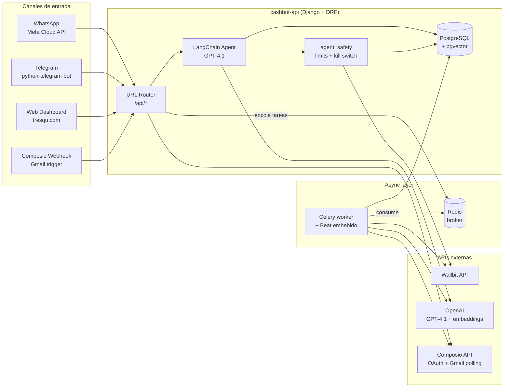
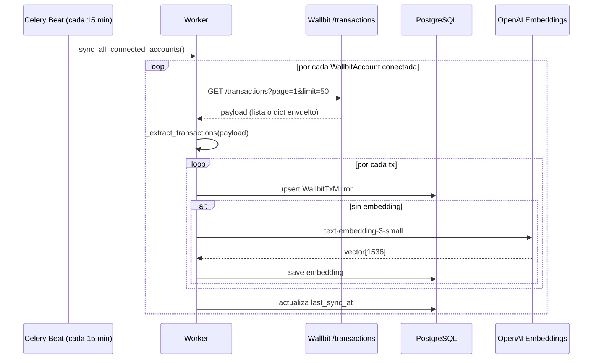
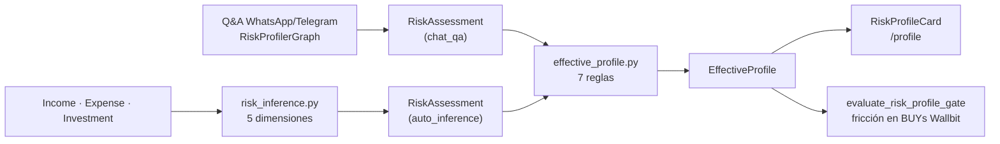

# Tresqu API

**Backend de gestión financiera personal con IA + integración Wallbit**

Django REST API para Tresqu. Combina gestión de gastos/ingresos, chatbots inteligentes (Telegram + WhatsApp), detección automática de compras vía Gmail, RAG con pgvector y — desde la última release — un **agente conversacional que opera sobre Wallbit** (saldos, transacciones, trading, Robo Advisor, tarjetas) con flujo de confirmación, auditoría y kill switch.

---

## Tabla de contenidos

- [¿Qué hace Tresqu?](#qué-hace-tresqu)
- [Arquitectura](#arquitectura)
- [Tech stack](#tech-stack)
- [Setup local paso a paso](#setup-local-paso-a-paso)
- [Variables de entorno](#variables-de-entorno)
- [Apps Django](#apps-django)
- [Integración Wallbit](#integración-wallbit)
- [Integración Gmail](#integración-gmail)
- [Perfil de riesgo del usuario](#perfil-de-riesgo-del-usuario)
- [Analista de mercado](#analista-de-mercado)
- [Endpoints REST](#endpoints-rest)
- [Celery & beat](#celery--beat)
- [Documentación API](#documentación-api)
- [Despliegue](#despliegue)

---

## ¿Qué hace Tresqu?

Tresqu es un copiloto financiero conversacional. El usuario habla con él por **WhatsApp, Telegram o la web** y el agente:

- Registra gastos/ingresos en lenguaje natural ("gasté 30k en almuerzo")
- Categoriza automáticamente con IA
- Detecta compras en correos de Gmail (polling vía Composio, ~2 min de latencia)
- Genera reportes y responde preguntas analíticas
- **(nuevo)** Consulta saldos y transacciones de **Wallbit**
- **(nuevo)** Propone órdenes de compra/venta de activos, movimientos entre cuentas DEFAULT/INVESTMENT, depósitos/retiros de Robo Advisor y bloqueo de tarjetas — todo bajo un flujo de **preview → confirmación explícita → ejecución** con límites por usuario y audit log

---

## Arquitectura

### Vista de alto nivel



### Arquitectura de la app `wallbit`

```mermaid
flowchart TB
    subgraph Inbound["Entrada del usuario"]
        MSG["'Compra USD 100 de AAPL'"]
    end

    subgraph Agent["LangChain agent"]
        LLM[GPT-4.1]
        TOOLS_R[Read tools<br/>balance, txs, assets]
        TOOLS_W[Write tools<br/>place_trade, move_funds...]
    end

    subgraph Safety["wallbit/agent_safety.py"]
        K{Kill switch?}
        L{AgentLimits?}
        R{Risk gate<br/>(solo BUY)}
        D[create_pending_decision]
    end

    subgraph Confirm["Flujo de confirmación"]
        UI["WhatsApp / Telegram / Web<br/>botón 'Confirmar' (2x si gate o limit)"]
        EX[executors.execute_decision]
    end

    subgraph Storage["Persistencia"]
        AD[(AgentDecision<br/>audit log + risk_gate)]
        WTM[(WallbitTxMirror<br/>+ embedding)]
        INV[(Investment)]
    end

    MSG --> LLM
    LLM -->|read-only| TOOLS_R
    LLM -->|propone escritura| TOOLS_W
    TOOLS_R --> WB1[Wallbit API]
    TOOLS_W --> K
    K -->|ok| L
    L -->|ok| R
    R -->|warning si aplica| D
    D --> AD
    D --> UI
    UI -->|POST /agent/confirm/:id| EX
    EX --> WB2[Wallbit API]
    EX --> AD
    EX --> WTM
    EX --> INV
```

### Flujo de sincronización Wallbit



---

## Tech stack

| Capa | Tecnologías |
|------|-------------|
| Runtime | Python 3.13 |
| Web framework | Django 5.2, Django REST Framework, drf-spectacular |
| Auth | JWT (djangorestframework-simplejwt) |
| Persistencia | PostgreSQL + pgvector |
| Async | Celery 5.5, Redis 7 (broker + result backend), Beat embebido |
| IA | LangChain + LangGraph 1.x, OpenAI GPT-4.1, text-embedding-3-small |
| Integraciones | python-telegram-bot, Meta WhatsApp Cloud API, Composio SDK (Gmail toolkit), Wallbit API |
| Seguridad | cryptography (Fernet) para cifrado de API keys, scope/IP whitelist en Wallbit |
| HTTP | httpx con backoff y respeto de `Retry-After` |
| Producción | Gunicorn, Docker, Railway (web + worker + Redis) |

---

## Setup local paso a paso

### Requisitos previos

- Docker y Docker Compose
- (Opcional) Python 3.13+ si quieres correr fuera de Docker
- Acceso a una OpenAI API key

### 1. Clonar y preparar `.env`

```bash
git clone <repo-url>
cd cashbot-api
cp .env.example .env
```

Edita `.env` y completa al menos:

```dotenv
OPENAI_API_KEY=sk-...
WALLBIT_ENCRYPTION_KEY=<cualquier string largo — se deriva con SHA-256 + Fernet>
```

> `WALLBIT_ENCRYPTION_KEY` puede ser cualquier string. Tresqu lo pasa por `SHA-256 → base64 → Fernet` antes de cifrar las API keys de los usuarios. **No la cambies en producción una vez tengas cuentas conectadas: invalidaría todas las keys cifradas.**

### 2. Levantar los servicios de soporte (db, redis, worker)

En dev corremos **Django directamente en el host** (recarga inmediata, debug más cómodo) y dejamos solo los servicios de soporte en Docker:

```bash
docker-compose -f docker-compose.dev.yml up -d db redis worker
```

| Servicio | Puerto host | Descripción |
|----------|-------------|-------------|
| `db` | 5433 | PostgreSQL + pgvector |
| `redis` | 6379 | Broker y result backend (expuesto al host para el runserver) |
| `worker` | — | Celery worker con Beat embebido (apunta a `redis:6379` interno) |

> El servicio `web` del compose existe pero no lo usamos en dev — corremos `runserver` en el host. Asegurate de tener `CELERY_BROKER_URL=redis://localhost:6379/0` en el `.env` para que el host hable con el Redis dockerizado.

### 3. Instalar dependencias y migrar en el venv del host

```bash
python -m venv venv && source venv/bin/activate
pip install -r requirements.txt
python manage.py migrate
python manage.py createcachetable  # tabla del state-token anti-replay (Composio)
```

### 4. Crear un superusuario (opcional)

```bash
python manage.py createsuperuser
```

### 5. Arrancar Django

```bash
python manage.py runserver
```

### 6. Verificar que todo está vivo

```bash
# API responde
curl http://localhost:8000/schema/swagger-ui/

# Worker registró las tareas
docker logs cashbot-worker | grep -E "wallbit\.tasks|composio_integration\.tasks|gmailbot\.composio_tasks"
```

Deberías ver al menos:
- `wallbit.tasks.sync_wallbit_transactions`, `wallbit.tasks.sync_all_connected_accounts`
- `composio_integration.tasks.provision_triggers_async`, `reprocess_stale_pending`, `retry_failed_connections`
- `gmailbot.composio_tasks.process_gmail_message_async`

### Comandos útiles

```bash
# Logs del worker (vivo)
docker logs -f cashbot-worker

# Shell de Django (host)
python manage.py shell

# Disparar manualmente una sync de Wallbit
python manage.py shell -c "from wallbit.tasks import sync_all_connected_accounts; sync_all_connected_accounts.delay()"

# Rebuild del worker tras cambiar requirements.txt
docker-compose -f docker-compose.dev.yml up -d --build worker

# Resetear toda la BD (destruye volúmenes)
docker-compose -f docker-compose.dev.yml down -v
```

---

## Variables de entorno

Consulta [`.env.example`](.env.example) para la lista completa. Las más relevantes para los módulos nuevos:

| Variable | Para qué sirve |
|----------|----------------|
| `OPENAI_API_KEY` | Agente LangChain + embeddings de pgvector |
| `WALLBIT_API_BASE_URL` | Default `https://api.wallbit.io` |
| `WALLBIT_ENCRYPTION_KEY` | Clave maestra para cifrar las API keys de los usuarios |
| `TWELVE_DATA_API_KEY` | Proveedor de precios históricos del analista de mercado. **Sin ella, el gráfico/histórico no carga** (el resto sigue operando) |
| `MARKETDATA_CACHE_URL` | Redis dedicado para cachear histórico (db 2). En dev/host: `redis://localhost:6379/2`. En prod, apuntar al Redis real. Degrada con gracia si no está disponible |
| `AGENT_ANALYST_MODEL` | Modelo del subagente analista (default `gpt-4.1`) |
| `CELERY_BROKER_URL` | Redis. En dev/host: `redis://localhost:6379/0`. En el worker dockerizado: `redis://redis:6379/0` (hardcoded en `docker-compose.dev.yml`) |
| `CELERY_RESULT_BACKEND` | Redis DB distinta. Mismas reglas de host vs container |
| `DATABASE_URL` | Postgres + pgvector |
| `COMPOSIO_API_KEY` | Llave de Composio (composio.dev) para el SDK |
| `COMPOSIO_WEBHOOK_SECRET` | Secret del webhook subscription de Composio — verifica HMAC de cada evento entrante |
| `COMPOSIO_GMAIL_AUTH_CONFIG_ID` | ID `ac_xxx` del auth config Gmail creado en el dashboard de Composio |
| `FRONTEND_URL` | Origen al que el callback OAuth redirige al usuario tras autorizar (ej. `https://tresqu.com`) |
| `META_WHATSAPP_*` | WhatsApp Cloud API |
| `TELEGRAM_BOT_TOKEN` | Telegram |

---

## Apps Django

| App | Responsabilidad |
|-----|----------------|
| `cashbotapp/` | Settings, URLs raíz, JWT, Celery wiring (`celery.py`), beat schedule |
| `users/` | Auth, JWT, perfiles, planes de suscripción, referidos |
| `expenses/` | CRUD de gastos + analytics, embeddings pgvector |
| `income/` | CRUD de ingresos + analytics |
| `categories/` | Categorías predefinidas y personalizadas |
| `savings/` | Metas de ahorro y proyecciones |
| `telegrambot/` | Bot de Telegram — NLP + agente LangChain |
| `whatsappbot/` | Bot WhatsApp — Meta API, voz (Whisper), imágenes (Vision) |
| `gmailbot/` | Parser de compras: recibe eventos del webhook de Composio, crea `ProcessedEmail` y `Expense`. La parte de OAuth/polling vive en `composio_integration/`. |
| **`composio_integration/`** | **(nuevo)** Broker genérico Composio (composio.dev). Hosting del SDK client, state machine OAuth (connect → callback → active → disconnect), verificación HMAC del webhook, state-token JWT con nonce anti-replay y tareas Celery. Toolkits nuevos (Slack, Notion, …) implementan el protocolo `ToolkitHandler` y se enganchan vía `registry`. Detalle: [`docs/COMPOSIO_ARCHITECTURE.md`](docs/COMPOSIO_ARCHITECTURE.md), [`docs/COMPOSIO_GMAIL_SETUP.md`](docs/COMPOSIO_GMAIL_SETUP.md) |
| **`wallbit/`** | Integración Wallbit: cliente HTTP, modelos, tools del agente, flujo de confirmación, sync periódico, RAG sobre transacciones |
| **`marketdata/`** | **(nuevo)** Capa de precios históricos intercambiable (Wallbit no expone histórico). Proveedor Twelve Data + servicio con caché y endpoint `/api/market/assets/{symbol}/history/`. Ver [`docs/MARKET_ANALYST.md`](docs/MARKET_ANALYST.md) |
| **`agents/`** | Sistema multi-agente: supervisor que orquesta subagentes (`manage_expenses_and_income`, `manage_wallbit`, **`analyze_investment`** — analista de mercado read-only) + perfil de riesgo (cuestionario LangGraph + inferencia + combinador). Ver [`docs/AGENTS_RISK_PROFILE.md`](docs/AGENTS_RISK_PROFILE.md) y [`docs/MARKET_ANALYST.md`](docs/MARKET_ANALYST.md) |

### Estructura interna de `wallbit/`

```
wallbit/
├── client.py          # WallbitClient (httpx + backoff + Retry-After + X-RateLimit-*)
├── crypto.py          # Fernet helpers (deriva clave de WALLBIT_ENCRYPTION_KEY)
├── models.py          # WallbitAccount, WallbitTxMirror, WallbitChestLink,
│                      # Investment, AgentDecision, AgentLimits, ParsedStatement
├── tools.py           # Read-only LangChain tools (balance, txs, assets)
├── write_tools.py     # Write-mode tools (proponen, NO ejecutan)
├── agent_safety.py    # Limits + kill switch + create_pending_decision
├── executors.py       # Ejecuta una AgentDecision confirmada contra Wallbit
├── rag.py             # tresqu_query_history sobre pgvector
├── tasks.py           # Celery: sync_wallbit_transactions, sync_all_connected_accounts
├── views.py           # Endpoints REST (connect, status, sync, agent/*)
├── serializers.py
├── urls.py
└── migrations/
```

---

## Integración Wallbit

### Capacidades del agente

| Tool | Tipo | Qué hace |
|------|------|---------|
| `wallbit_get_balance` | read | Saldo checking + posiciones de acciones |
| `wallbit_list_transactions` | read | Últimas tx con filtro por tipo y fecha |
| `wallbit_search_assets` | read | Busca acciones/ETFs/bonos por símbolo o categoría |
| `wallbit_get_asset` | read | Ficha completa de un activo |
| `tresqu_query_history` | read | RAG sobre gastos + ingresos + tx Wallbit |
| `wallbit_place_trade` | **write** | Propone BUY/SELL — requiere confirmación |
| `wallbit_move_funds` | **write** | Mueve fondos DEFAULT ↔ INVESTMENT |
| `wallbit_deposit_chest` | **write** | Deposita en un Robo Advisor |
| `wallbit_withdraw_chest` | **write** | Retira de un Robo Advisor |
| `wallbit_set_card_status` | **write** | Activa o suspende una tarjeta Wallbit |

Las tools **write** nunca llaman a Wallbit por sí mismas. Solo crean una `AgentDecision(requires_confirmation=True)` y devuelven un preview con `confirmation_id`. El usuario confirma con un botón → `POST /api/wallbit/agent/confirm/{id}/` → `executors.execute_decision()` hace la llamada real.

### Modelo de seguridad (resumen)

1. **API key Wallbit nunca sale del backend.** Se valida contra `/balance/checking` al conectar, se cifra con Fernet y se persiste como `encrypted_api_key`.
2. **Pre-flight de 4 pasos** en toda escritura:
   1. `get_account_or_raise` — cuenta conectada
   2. `check_kill_switch` — kill switch apagado
   3. `evaluate_*_limits` — monto + tope diario + allow/block lists
   4. `evaluate_risk_profile_gate` — solo BUYs; nunca bloquea, solo agrega warning + doble confirmación cuando el monto no encaja con la tolerancia efectiva (ver [Perfil de riesgo](#perfil-de-riesgo-del-usuario))
3. **`AgentLimits` por usuario** (configurables vía `/api/wallbit/limits/`):
   - `max_trade_usd` (default 500)
   - `max_daily_move_usd` (default 1000)
   - `allowed_symbols` / `blocked_symbols`
   - `require_2step_above_usd` (default 200)
4. **Kill switch global por cuenta** (`WallbitAccount.kill_switch_until`). Al desconectar desde la UI se setea a hoy + 365d.
5. **Audit log inmutable** en `AgentDecision`: input del usuario, tool propuesta, args (incluye `risk_gate` cuando aplica), preview, ejecutado sí/no, uuid de la tx Wallbit resultante.
6. **Logs nunca contienen la API key** — `WallbitClient` la pasa solo por header `X-API-Key`.

### Sincronización periódica

- Tarea: `wallbit.tasks.sync_all_connected_accounts`
- Schedule: cada 15 min (`CELERY_BEAT_SCHEDULE` en `cashbotapp/settings.py:376`)
- Encola un `sync_wallbit_transactions(account_id)` por cada cuenta conectada
- Cada tx se **upsertea en `WallbitTxMirror`** y se le calcula un embedding `text-embedding-3-small` (1536 dims) para que `tresqu_query_history` pueda hacer búsqueda semántica sobre tu historial financiero combinado.

---

## Integración Gmail

Detección automática de compras en correos vía **Composio**:

1. Usuario abre Perfil → Conexiones → "Conectar Gmail".
2. El frontend pide `GET /api/integrations/gmail/connect-url/` → backend crea un `ComposioConnection(status=pending)` con state-token JWT firmado, devuelve la URL de Connect Link alojada por Composio.
3. El usuario autoriza en Google → Composio redirige a `/api/integrations/gmail/callback/?state=...&connected_account_id=ca_xxx`.
4. El backend valida state-token + nonce, marca `status=active`, llama `complete_connect_flow` y encola `provision_triggers_async`.
5. El worker llama al SDK de Composio y crea un trigger `GMAIL_NEW_GMAIL_MESSAGE` (polling cada 2 min por default).
6. Cada nuevo correo: Composio → `POST /api/integrations/gmail/composio-webhook/` (HMAC firmado) → backend valida firma, crea `ProcessedEmail`, encola `gmailbot.composio_tasks.process_gmail_message_async`.
7. La IA analiza si es compra; si lo es, crea el `Expense` y queda `awaiting_categorization=true`. El usuario asigna categoría desde la UI o respondiendo por WhatsApp/Telegram.

### Endpoints (todo bajo el prefijo genérico `/api/integrations/<toolkit>/`)

| Endpoint | Método | Auth | Propósito |
|----------|--------|------|----------|
| `/connect-url/` | GET | JWT | Inicia OAuth, devuelve `{redirect_url, connected_account_id, already_connected}` |
| `/callback/` | GET | — (state-token) | Landing del OAuth — redirige al frontend |
| `/composio-webhook/` | POST | HMAC (`webhook-signature`) | Eventos de trigger entrantes |
| `/status/` | GET | JWT | Estado para la UI (`connected`, `trigger_active`, contadores) |
| `/disconnect/` | POST | JWT | Borra trigger + connected_account en Composio, marca local `disconnected` |
| `/retry-trigger/` | POST | JWT | Re-encola `provision_triggers_async` si quedó en `failed` |

El listado read-only de correos procesados sigue en `/api/gmail/processed-emails/` (paginado).

### Beat schedules

- `composio-reprocess-stale-pending` cada 5 min: re-encola `ProcessedEmail` stuck en `pending > 10 min`.
- `composio-retry-failed-connections` cada 1 h: vuelve a `active` y reintenta provisioning en conexiones que cayeron en `failed`.

Detalle de arquitectura, decisiones de diseño y migración: [`docs/COMPOSIO_ARCHITECTURE.md`](docs/COMPOSIO_ARCHITECTURE.md) · [`docs/COMPOSIO_GMAIL_SETUP.md`](docs/COMPOSIO_GMAIL_SETUP.md) · [`docs/COMPOSIO_GMAIL_MIGRATION.md`](docs/COMPOSIO_GMAIL_MIGRATION.md) · [`gmailbot/README.md`](gmailbot/README.md)

---

## Perfil de riesgo del usuario

Antes de que Tresqu (o el agente) opere dinero del usuario en Wallbit, hace
falta saber **qué tan agresivo puede ser**. La app `agents/` resuelve eso
combinando tres piezas independientes:



### Piezas

| Pieza | Tipo | LLM | Tools |
|-------|------|-----|-------|
| `agents/graphs/risk_profiler.py` | LangGraph con interrupts | 1 llamada GPT-4.1 (síntesis final) | **0** |
| `agents/risk_inference.py` | Código determinista | — | — |
| `agents/effective_profile.py` | Reglas puras | — | — |

### Cinco dimensiones inferidas (escala 0-100, más alto = más agresivo)

| Dimensión | Peso | Fuente | Lectura |
|-----------|------|--------|---------|
| `savings_rate` | 25% | `Income`/`Expense` 90d | % de ingreso que no se gasta |
| `income_stability` | 20% | `Income` mensual, downside-only | Solo penaliza meses por debajo de la media |
| `expense_stability` | 10% | `Expense` mensual, upside-only | Solo penaliza picos por encima de la media |
| `holdings_appetite` | 25% | `Investment` (Wallbit) | % en STOCK/ETF vs BOND/ROBO/CHEST |
| `liquidity_buffer` | 20% | Histórico completo | Meses de gasto cubiertos por ahorro acumulado |

Score → tolerancia: 0-35 conservative · 36-65 moderate · 66-100 aggressive.

### Regla de combinación clave

| Caso | Decisión | Por qué |
|------|----------|---------|
| Declarado **más conservador** que inferido | Respetamos lo declarado | Si te subestimas, tu prudencia gana |
| Declarado **más agresivo** que inferido (sin `user_override`) | **Safety cap** — usamos el inferido | Si te sobreestimas, tu billetera real gana |
| `user_override=True` (editado manualmente) | Lo declarado siempre | Quien edita desde el dashboard sabe lo que firma |

Cache de inferencia: **7 días** (`DEFAULT_MAX_AGE_DAYS`). Se recomputa
on-demand cuando `get_effective_profile()` ve un assessment vencido.

### Consumo: gate de BUY en Wallbit

`wallbit/agent_safety.evaluate_risk_profile_gate` lee el perfil efectivo
en cada compra propuesta por el agente. **Nunca bloquea**: agrega un
`warning` y enciende `extra_two_step` cuando el tamaño del trade no
encaja con la tolerancia.

| Tolerancia efectiva | Tamaño | Resultado |
|---------------------|--------|-----------|
| `aggressive` | cualquiera | pasa derecho |
| `moderate` | < 50% `max_trade_usd` | pasa derecho |
| `moderate` | ≥ 50% `max_trade_usd` | warning + 2x confirm |
| `conservative` | cualquiera | warning + 2x confirm |

El veredicto queda persistido en `AgentDecision.tools_called[0].args.risk_gate`
y el bot de WhatsApp lo renderiza como bloque `🛡️ Riesgo: …` en el
mensaje de confirmación. SELL, moves entre cuentas, robo y card status no
pasan por el gate.

Detalle completo, diagramas y caveats: [`docs/AGENTS_RISK_PROFILE.md`](docs/AGENTS_RISK_PROFILE.md).

---

## Analista de mercado

Subagente **read-only** (`agents/subagents/analyst.py`), expuesto al supervisor
como `analyze_investment`. Ayuda a decidir dando **datos + contexto + educación**
sobre activos — nunca asesoría ("compra/vende X") ni predicciones.

Cruza tres fuentes para contextualizar: **mercado** (precio actual + serie
histórica), **perfil de riesgo efectivo** y **portafolio Wallbit** (peso % por
posición). Responde por WhatsApp/Telegram ("¿cómo va NVDA este mes?") y alimenta
el gráfico de precios del dashboard.

Como Wallbit no expone histórico, la serie viene de la capa `marketdata/`
(proveedor **Twelve Data** intercambiable) vía
`GET /api/market/assets/{symbol}/history/?range=`. Resultados cacheados por
`(símbolo, rango)` para cuidar la cuota; 1 consulta = 1 crédito.

Detalle completo: [`docs/MARKET_ANALYST.md`](docs/MARKET_ANALYST.md).

---

## Endpoints REST

| Endpoint | Descripción |
|----------|-------------|
| `/api/token/` · `/api/token/refresh/` | JWT auth |
| `/api/users/` | Usuarios y perfiles |
| `/api/expenses/` | CRUD de gastos |
| `/api/incomes/` | CRUD de ingresos |
| `/api/categories/` | Categorías |
| `/api/savings/` | Metas de ahorro |
| `/api/integrations/gmail/*` | Conectar / desconectar / status / webhook de Gmail (vía Composio) |
| `/api/gmail/processed-emails/` | Listado paginado de correos procesados |
| **`/api/wallbit/connect/`** | Valida y guarda una API key cifrada |
| **`/api/wallbit/status/`** | Estado de conexión del usuario |
| **`/api/wallbit/disconnect/`** | Revoca + activa kill switch |
| **`/api/wallbit/sync/`** | Encola un sync manual |
| **`/api/wallbit/limits/`** | GET/POST de `AgentLimits` |
| **`/api/wallbit/agent/decisions/`** | Audit log paginado |
| **`/api/wallbit/agent/confirm/{id}/`** | Ejecuta una decisión pendiente |
| **`/api/wallbit/assets/search/`** | **(nuevo)** Busca en el catálogo de Wallbit (cualquier acción/ETF invertible) |
| **`/api/market/assets/{symbol}/history/`** | **(nuevo)** Serie histórica de precios para el gráfico (proveedor Twelve Data) |
| **`/api/agents/risk-profile/`** | GET/POST/DELETE del perfil declarado (POST = manual override) |
| **`/api/agents/risk-profile/effective/`** | Perfil **efectivo** combinando declarado + inferido (consume esto desde frontend y guardrails) |
| **`/api/agents/risk-profile/history/`** | Audit log paginado de `RiskAssessment` |
| `/telegram/` | Webhook Telegram |
| `/whatsapp/` | Webhook WhatsApp (Meta) |
| `/schema/swagger-ui/` · `/schema/redoc/` | Documentación interactiva |

---

## Celery & beat

- **Broker:** Redis (`CELERY_BROKER_URL`)
- **Result backend:** Redis DB separada (`CELERY_RESULT_BACKEND`)
- **Beat:** embebido en el worker con `-B --scheduler celery.beat:PersistentScheduler` (1 sola réplica obligatoria por eso)
- **Schedules activos:**
  - `wallbit-sync-all-connected` cada 15 min
  - `composio-reprocess-stale-pending` cada 5 min
  - `composio-retry-failed-connections` cada 1 hora
- **Timeouts:** `CELERY_TASK_TIME_LIMIT = 5 min` / `_SOFT_TIME_LIMIT = 4 min`

---

## Documentación API

`drf-spectacular` genera la spec OpenAPI a partir de las views:

- Swagger UI: <http://localhost:8000/schema/swagger-ui/>
- ReDoc: <http://localhost:8000/schema/redoc/>
- Schema JSON: <http://localhost:8000/schema/>

---

## Despliegue

Tresqu corre en producción en **Railway** con tres servicios (`web`, `worker`, `Redis`) y autodeploy desde `main`. La BD productiva es **Supabase Postgres** (con `pgvector` habilitado), no la instancia de Railway.

- `Procfile` declara `release: python manage.py migrate && python manage.py createcachetable` y `web: gunicorn cashbotapp.wsgi` — cada release aplica migraciones nuevas y garantiza la existencia de `django_cache_table` (usada por el state-token anti-replay de Composio).
- El servicio `worker` corre `celery -A cashbotapp worker -B --scheduler celery.beat:PersistentScheduler` con beat embebido — **una sola réplica** porque el scheduler persistente no tolera múltiples instancias.
- Variables Composio (`COMPOSIO_API_KEY`, `COMPOSIO_WEBHOOK_SECRET`, `COMPOSIO_GMAIL_AUTH_CONFIG_ID`) deben estar seteadas en **ambos** servicios (web y worker).
- El webhook URL configurado en el dashboard de Composio debe apuntar a `https://api.tresqu.com/api/integrations/gmail/composio-webhook/`.

Para detalle de configuración por servicio ver el README interno del equipo.

---

## Licencia

Proyecto privado — Tresqu
