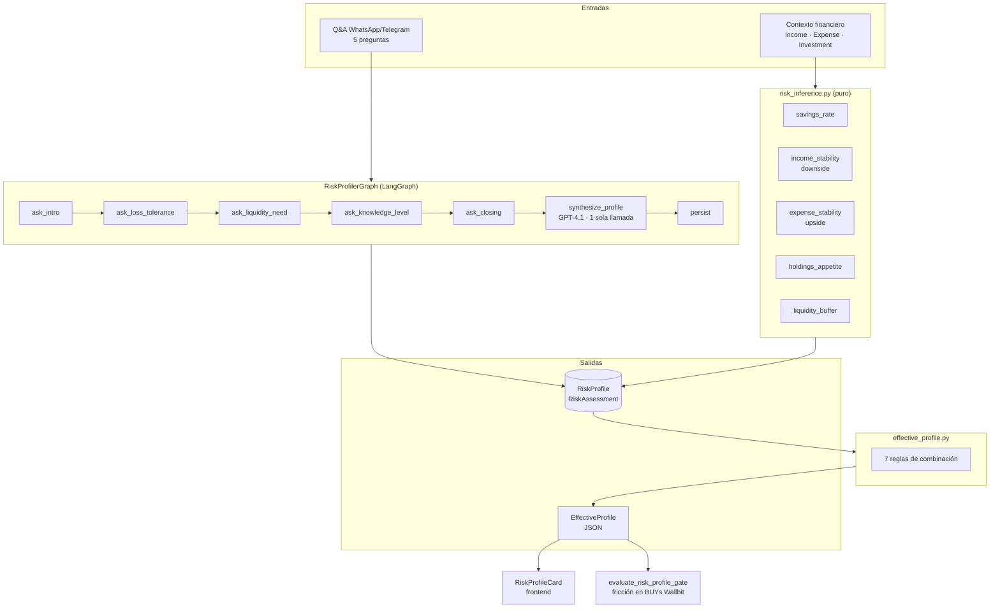
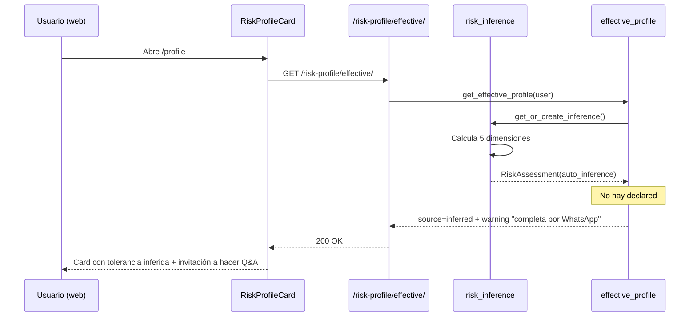
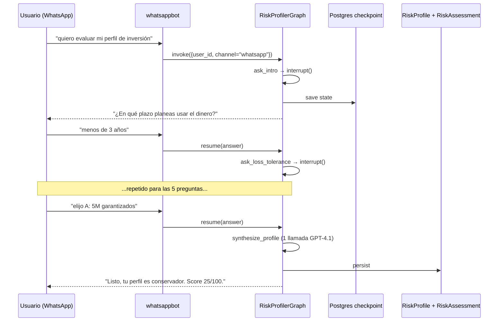
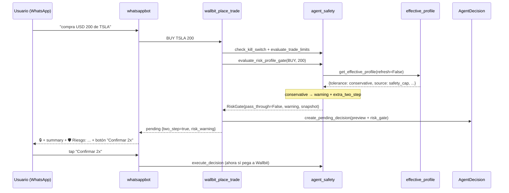

# Perfil de riesgo del usuario (`agents/`)

Sistema de perfilamiento de tolerancia al riesgo de inversión. Combina un
cuestionario conversacional (declarado por el usuario) con una inferencia
automática derivada de su contexto financiero, aplicando reglas de
combinación que protegen contra la auto-evaluación inflada sin quitar
agencia al usuario.

Este perfil es el insumo que el guardrail
`wallbit/agent_safety.evaluate_risk_profile_gate` consume para gradar la
fricción de las compras en Wallbit (ver
[Pieza 4](#pieza-4--gate-de-confirmación-para-buys-en-wallbit) y
[`WALLBIT_INTEGRATION.md`](WALLBIT_INTEGRATION.md)).

---

## Tabla de contenidos

- [¿Qué es y para qué sirve?](#qué-es-y-para-qué-sirve)
- [Arquitectura](#arquitectura)
- [Pieza 1 — `RiskProfilerGraph` (Q&A conversacional)](#pieza-1--riskprofilergraph-qa-conversacional)
- [Pieza 2 — Inferencia automática (`risk_inference.py`)](#pieza-2--inferencia-automática-risk_inferencepy)
- [Pieza 3 — Perfil efectivo (`effective_profile.py`)](#pieza-3--perfil-efectivo-effective_profilepy)
- [Pieza 4 — Gate de confirmación para BUYs en Wallbit](#pieza-4--gate-de-confirmación-para-buys-en-wallbit)
- [Modelos de datos](#modelos-de-datos)
- [Endpoints REST](#endpoints-rest)
- [Frontend (RiskProfileCard)](#frontend-riskprofilecard)
- [Flujos típicos](#flujos-típicos)
- [Caveats y limitaciones](#caveats-y-limitaciones)
- [Roadmap](#roadmap)

---

## ¿Qué es y para qué sirve?

El usuario va a operar dinero real desde Wallbit. Antes de dejarlo (o de
dejar que un agente lo asista) hay que saber **qué tan agresivo puede ser
sin lastimarse**. Las opciones honestas son:

1. **Preguntarle** — `RiskProfilerGraph` lo hace por WhatsApp/Telegram con
   un cuestionario de 5 preguntas.
2. **Inferirlo de su contexto** — `risk_inference.py` lo deriva de su
   actividad real (ahorro, estabilidad de ingresos/gastos, portafolio
   actual, colchón acumulado).
3. **Combinar ambas señales** — `effective_profile.py` decide cuál usar y
   cuándo cubrir al usuario de sí mismo.

El resultado es un `EffectiveProfile` con tolerancia
(`conservative`/`moderate`/`aggressive`), score 0-100, fuente (`declared` /
`inferred` / `agreement` / `safety_cap` / `default`) y un warning
opcional cuando hay discrepancia.

---

## Arquitectura



**Las tres piezas son independientes**:

- El graph no sabe que existe la inferencia.
- La inferencia es código determinista, no usa LLM, no usa tools.
- El combinador solo lee los assessments y aplica reglas.

---

## Pieza 1 — `RiskProfilerGraph` (Q&A conversacional)

Vive en `agents/graphs/risk_profiler.py`. Es un `StateGraph` con
**checkpoint en Postgres** (sobrevive reinicios) y `thread_id` por usuario.

### Cuándo se ejecuta

Cuando el usuario pide evaluar su perfil de inversión por WhatsApp o
Telegram. El supervisor del chatbot enruta al graph. **No es proactivo**
todavía — espera a que el usuario lo pida.

### Tools que usa

**Cero tools**. El graph es lineal: hace 5 preguntas y al final invoca el
LLM una vez para sintetizar.

### Las 5 preguntas (texto fijo)

| Nodo | Pregunta resumida | Qué buscamos |
|------|-------------------|--------------|
| `ask_intro` | Horizonte temporal del dinero invertido | Tolerancia a iliquidez |
| `ask_loss_tolerance` | Reacción ante caída del 20% (a/b/c/d) | Tolerancia emocional al drawdown |
| `ask_liquidity_need` | % que necesita líquido | Capacidad de inmovilización |
| `ask_knowledge_level` | Familiaridad con instrumentos (1-10) | Sofisticación financiera |
| `ask_closing` | 5M garantizados vs lotería 12M | Aversión al riesgo bajo presión |

Cada `ask_*` emite un `interrupt()` que pausa el graph hasta que llegue
la siguiente respuesta del usuario vía `Command(resume=...)`.

### Síntesis (única llamada al LLM)

`synthesize_profile` arma un `SystemMessage` + `HumanMessage` con las 5
respuestas + un poco de contexto financiero del usuario (income, expense
totals), y pide a `gpt-4.1` que devuelva JSON con
`{tolerance, score, dimensions, confidence, reason}`. Usa
`response_format={"type": "json_object"}` para garantizar parsing.

### Persistencia (`persist`)

```python
RiskProfile.update_or_create(user=..., defaults={
    tolerance, score, dimensions, confidence,
    user_override=False,           # NO override — viene de Q&A, no manual
    derived_from={
        "method": "chat_qa",
        "channel": "whatsapp" | "telegram" | ...,
        "completed_at": <ISO>,
    },
    notes=draft.reason,
})
RiskAssessment.objects.create(
    profile=...,
    triggered_by=RiskAssessment.CHAT_QA,
    context_snapshot={"answers": ..., "context": ...},
)
```

---

## Pieza 2 — Inferencia automática (`risk_inference.py`)

Pura aritmética sobre lo que ya está en la DB. Cinco dimensiones en escala
0-100 (más alto = más capacidad/apetito de riesgo).

### Fuentes de datos

| Dimensión | Tabla / consulta |
|-----------|------------------|
| `savings_rate` | `Income` + `Expense`, últimos 90 días |
| `income_stability` | `Income` agrupado por mes, últimos 90 días, **semi-deviation hacia abajo** |
| `expense_stability` | `Expense` agrupado por mes, últimos 90 días, **semi-deviation hacia arriba** |
| `holdings_appetite` | `Investment` (Wallbit) — neto BUY−SELL por `kind` |
| `liquidity_buffer` | `Income` − `Expense` de toda la historia ÷ gasto mensual promedio |

### Pesos del score global

```python
WEIGHTS = {
    "savings_rate":      0.25,
    "income_stability":  0.20,
    "expense_stability": 0.10,
    "holdings_appetite": 0.25,
    "liquidity_buffer":  0.20,
}
```

Score → tolerancia:

| Score | Tolerancia |
|-------|------------|
| 0 – 35 | Conservative |
| 36 – 65 | Moderate |
| 66 – 100 | Aggressive |

### Semi-deviation (downside-only)

Las dimensiones de estabilidad usan **deviación parcial** (Sortino-style)
en vez de coeficiente de variación clásico. Razones:

- **Income**: un mes con un bono (mejor) **no** debe penalizar. Solo
  cuentan los meses **por debajo** de la media. `_downside_cv(direction="below")`.
- **Expense**: un mes barato (mejor) **no** debe penalizar. Solo cuentan
  los **picos** por encima de la media. `_downside_cv(direction="above")`.

El bucketing (`_stability_from_cv`) se mantiene con los mismos cortes:
0.05 / 0.15 / 0.30 / 0.50 → 100 / 75 / 50 / 25 / 0.

### Bucket de `savings_rate`

```
≤ 0     → 0    (gasta más de lo que ingresa)
< 10%   → 20
< 20%   → 40
< 35%   → 60   (rango saludable LATAM)
< 50%   → 80
≥ 50%   → 100  (excepcional)
```

### Bucket de `holdings_appetite`

`STOCK`/`ETF` se consideran **agresivos**; `BOND`/`ROBO`/`CHEST` **defensivos**.

```
≥ 70% agresivo   → 100
≥ 50% agresivo   → 80
≥ 30% agresivo   → 60
≥ 70% defensivo  → 10
≥ 50% defensivo  → 30
otro / sin posiciones → 50
```

### Bucket de `liquidity_buffer`

Acumulado neto desde el primer registro ÷ gasto mensual promedio últimos
90 días = **meses de runway**.

```
< 0 meses    → 0    (deuda neta acumulada)
< 1 mes      → 15
1 – 3 meses  → 40
3 – 6 meses  → 70   (Dave Ramsey "saludable")
6 – 12 meses → 90
12+ meses    → 100
```

**Si el usuario tiene menos de `BUFFER_MIN_DAYS = 60` días de registros**,
la dimensión devuelve **50 (neutro)** con `has_buffer=False` y la card lo
muestra como "Aún sin historial". Esto evita penalizar/premiar a usuarios
nuevos sobre ruido.

### Caché y persistencia

Cada inferencia se persiste como
`RiskAssessment(triggered_by="auto_inference")`. Por defecto se cachea
**7 días** (`DEFAULT_MAX_AGE_DAYS`). Funciones públicas:

| Función | Comportamiento |
|---------|----------------|
| `compute_inference(user)` | Función pura. Calcula y devuelve `InferenceResult`. No persiste. |
| `latest_inference(user, max_age_days)` | Devuelve el cache si está fresco. No recomputa. |
| `get_or_create_inference(user, max_age_days=7, force=False)` | Devuelve cache si fresco; si no, recomputa y persiste. `force=True` siempre recomputa. |

### Confidence

Empieza en 0.40 y crece según la densidad de datos:

- `+0.15` si hay ≥ 10 transacciones
- `+0.10` si hay ≥ 30 transacciones
- `+0.10` si hay ≥ 2 meses de income y expense
- `+0.10` si hay ≥ 3 meses de income y expense
- `+0.10` si hay holdings registrados
- `+0.05` si el buffer es confiable (≥ 60 días)

Cap a `0.95`.

---

## Pieza 3 — Perfil efectivo (`effective_profile.py`)

Reconcilia `declared` (último assessment de tipo Q&A, manual override,
user request o initial) con `inferred` (último auto_inference fresco).

### Las 7 reglas

| # | Caso | Decisión | Warning |
|---|------|----------|---------|
| 1 | Declarado + inferido **coinciden** | `source=agreement`, score = promedio | — |
| 2 | Declarado + inferido **divergen** y `user_override=True` | `source=declared`, usar lo declarado | "Configuraste el perfil manualmente, respetamos esa elección" |
| 3 | Declarado **más agresivo** que inferido (sin override) | `source=safety_cap`, usar el **inferido** | "Tu situación financiera sugiere un perfil más prudente. Puedes ajustarlo manualmente si estás seguro." |
| 4 | Declarado **más conservador** que inferido | `source=declared`, usar lo declarado | "Eres más prudente que tu contexto. Respetamos tu elección." |
| 5 | Solo declarado | `source=declared` | — |
| 6 | Solo inferido | `source=inferred`, confidence − 0.1 | "Estamos usando un perfil inferido. Completa el cuestionario por WhatsApp/Telegram." |
| 7 | Ninguno | `source=default`, moderate 50, confidence 0.30 | "Aún no tenemos suficiente información." |

### Asimetría intencional

- **Si te subestimas, te dejamos** (regla 4). Tu prudencia gana.
- **Si te sobreestimas, te capamos** (regla 3). Tu billetera real gana.
- **`user_override=True` rompe el cap** (regla 2). Solo se prende cuando
  el usuario edita el perfil desde el dashboard — quien hace eso sabe lo
  que firma.

### Sincronización con `RiskProfile`

`_sync_profile_row()` mantiene la fila legacy `RiskProfile.tolerance/score`
alineada con el `EffectiveProfile` para readers que aún consultan la tabla
directamente. **No pisa `dimensions` si el perfil es `user_override`**.

> ⚠️ **Bug conocido**: `_sync_profile_row` sí sobrescribe
> `derived_from = {"source": <effective_source>}` aun cuando hubo un Q&A
> previo con `{"method": "chat_qa", ...}`. Pendiente de fix — mergear en
> vez de reemplazar.

---

## Pieza 4 — Gate de confirmación para BUYs en Wallbit

Vive en `wallbit/agent_safety.evaluate_risk_profile_gate`. Es el primer
consumidor real del `EffectiveProfile` fuera del dashboard: convierte la
tolerancia combinada en **fricción** sobre las compras propuestas por el
agente.

### Qué hace y qué no hace

- **No bloquea.** Wallbit son operaciones de dinero real; la última
  palabra siempre es del usuario. El gate solo emite un `warning` y
  enciende `extra_two_step` para que el bot muestre un prompt de
  confirmación más fuerte.
- **Solo aplica a BUYs.** Vender, mover fondos entre cuentas internas,
  depositar/retirar de Robo Advisor y congelar tarjetas pasan derecho
  porque no aumentan exposición a riesgo de mercado.
- **Lee con `refresh_inference=False`.** El gate está en el hot path de
  cada preview; recomputar la inferencia ahí sería caro. El refresh se
  dispara desde el dashboard, el comando `/perfil` por chat y los runs de
  Celery beat.

### Reglas

| Tolerancia efectiva | Tamaño del trade | Resultado |
|---------------------|------------------|-----------|
| `aggressive`       | cualquiera | `pass_through`, sin warning |
| `moderate`         | < 50 % de `max_trade_usd` | `pass_through`, sin warning |
| `moderate`         | ≥ 50 % de `max_trade_usd` | warning + `extra_two_step` |
| `conservative`     | cualquiera | warning + `extra_two_step` |
| desconocida / null | cualquiera | `pass_through` (degradado seguro) |

Cuando `effective.source ∈ {inferred, default}` (baja certeza), el warning
añade una invitación a evaluar el perfil formalmente con el asistente.

### Lugar en la pipeline de seguridad

`_preview_place_trade` (`wallbit/write_tools.py`) corre los checks en este
orden — los errores cortan antes de llegar al gate:

1. `get_account_or_raise` — cuenta conectada
2. `check_kill_switch` — kill switch apagado
3. `evaluate_trade_limits` — monto + allow/block lists + tope diario
4. **`evaluate_risk_profile_gate` — apetito vs tamaño**
5. `create_pending_decision` — persiste `AgentDecision` con preview

### Audit log

El veredicto del gate se persiste dentro de `AgentDecision.tools_called[0].args.risk_gate`:

```json
{
  "pass_through": false,
  "extra_two_step": true,
  "warning": "Tu perfil efectivo es conservador...",
  "tolerance": "conservative",
  "source": "safety_cap"
}
```

Esto permite reconstruir, para cualquier trade pasado, qué decidió el
gate en el momento — útil para investigar discrepancias o reclamos
futuros.

### Render en el canal

El preview lleva dos campos opcionales que el bot puede mostrar:

| Campo | Tipo | Notas |
|-------|------|-------|
| `preview.risk_warning` | string | Texto humano del gate. Solo presente cuando no es `pass_through`. |
| `preview.risk_profile` | object | `{tolerance, source, confidence}` siempre que haya snapshot. |

Hoy `whatsappbot/wallbit_handlers._summary_text` lo embebe como un bloque
`🛡️ Riesgo: …` arriba del "¿Confirmas?". El label del botón cambia a
"Confirmar 2x" cuando `two_step_required` es `true` (puede venir del
límite de monto o del gate; cualquiera de los dos lo activa).

Telegram aún no renderiza preview de Wallbit. Cuando se cablée el chat
web (sub-fase pendiente), debe consumir los mismos dos campos para
paridad.

---

## Modelos de datos

### `RiskProfile` (1 por usuario)

| Campo | Tipo | Notas |
|-------|------|-------|
| `user` | OneToOne | |
| `tolerance` | Choice | `conservative` / `moderate` / `aggressive` |
| `score` | int 0-100 | |
| `dimensions` | JSONField | Snapshot del último cálculo |
| `confidence` | float 0-1 | |
| `user_override` | bool | `True` si el usuario lo editó manualmente |
| `derived_from` | JSONField | Metadata: `{method, channel, completed_at}` |
| `notes` | text | Reason del último assessment |
| `last_assessed_at` | datetime | |

### `RiskAssessment` (N por usuario — audit log)

| Campo | Notas |
|-------|-------|
| `profile` | FK → `RiskProfile` |
| `tolerance`, `score`, `dimensions`, `confidence`, `reason` | Snapshot |
| `triggered_by` | `initial` / `chat_qa` / `auto_inference` / `context_drift` / `user_request` / `manual_override` |
| `context_snapshot` | JSONField — datos brutos en el momento (savings, holdings, buffer, answers...) |
| `created_at` | indexado para queries `_latest_*` |

Cada assessment es **inmutable** — se crea uno nuevo en cada evaluación
para preservar la línea de tiempo.

---

## Endpoints REST

Todos bajo `/api/agents/` y requieren JWT.

| Método | Path | Descripción |
|--------|------|-------------|
| `GET` | `/risk-profile/` | Perfil actual desde tabla `RiskProfile`. Devuelve `{exists: false}` si no hay. |
| `POST` | `/risk-profile/` | Upsert manual del perfil — setea `user_override=True` y registra un `RiskAssessment(manual_override)`. |
| `DELETE` | `/risk-profile/` | Borra `RiskProfile` (no los `RiskAssessment` históricos). |
| `GET` | `/risk-profile/effective/` | **Endpoint principal**. Devuelve el `EffectiveProfile` combinado. Refresca auto-inferencia si el cache (default 7 días) está vencido. |
| `GET` | `/risk-profile/history/` | Paginado de `RiskAssessment` del usuario. |

### Query params de `/effective/`

| Param | Default | Efecto |
|-------|---------|--------|
| `refresh=1` | — | Ignora cache de inferencia, recomputa |
| `max_age_days=N` | `7` | Override del TTL del cache |

### Forma de la respuesta

```json
{
  "tolerance": "conservative",
  "score": 25,
  "confidence": 0.8,
  "source": "declared",
  "user_override": false,
  "warning": "Eres más prudente que tu contexto. Respetamos tu elección.",
  "declared": {
    "tolerance": "conservative",
    "score": 25,
    "dimensions": { ... },
    "confidence": 0.8,
    "reason": "...",
    "triggered_by": "chat_qa",
    "recorded_at": "2026-05-26T13:14:00Z"
  },
  "inferred": {
    "tolerance": "aggressive",
    "score": 62,
    "dimensions": {
      "savings_rate": 100,
      "income_stability": 0,
      "expense_stability": 25,
      "holdings_appetite": 100,
      "liquidity_buffer": 50
    },
    "confidence": 0.6,
    "reason": "Inferencia automática: tasa de ahorro 91% ...",
    "triggered_by": "auto_inference",
    "recorded_at": "2026-05-26T13:14:00Z"
  }
}
```

---

## Frontend (`RiskProfileCard`)

Vive en `chat-finance-bot/src/components/dashboard/RiskProfileCard.tsx` y
se monta en `/profile`.

| Pieza visible | Datos consumidos |
|---------------|------------------|
| Score grande + badge de tolerancia + badge de `source` | `tolerance`, `score`, `source`, `user_override` |
| Banner de warning (con ícono distinto si `source=safety_cap`) | `warning` |
| Radar de 5 dimensiones (Recharts) | `inferred.dimensions` (fallback a `declared.dimensions`) |
| Botón "Reevaluar" | Dispara `GET ?refresh=1` |
| HoverCard sobre el score | Tabla de rangos 0-35 / 36-65 / 66-100 |
| Popover en "Dimensiones del contexto" | Qué mide cada dimensión + peso |
| Collapsible "¿Cómo se calculó tu perfil?" | Comparación inferido vs declarado, desglose por dimensión con interpretación textual, resumen del `reason` |

Hooks:

- `useEffectiveProfile()` → `useQuery(['risk-profile', 'effective'])`, staleTime 5 min
- `useRefreshEffectiveProfile()` → `useMutation` que dispara `?refresh=1` y actualiza el cache

Servicio: `src/services/riskProfile/riskProfile.ts`. Tipos en
`src/types/riskProfile.ts`.

---

## Flujos típicos

### Flujo A — Usuario nuevo abre el dashboard



### Flujo B — Usuario responde Q&A por WhatsApp



### Flujo C — Gate de BUY (sub-fase 1.5, implementada)



---

## Caveats y limitaciones

1. **El "acumulado" no es tu saldo bancario.** El `liquidity_buffer` se
   calcula sobre lo que el usuario registró en Tresqu, no sobre su cuenta
   real. La UI dice esto explícitamente.
2. **La estabilidad solo se calcula si hay ≥ 2 meses con datos.** Con
   menos, devuelve 50 (neutro).
3. **Solo se considera la **última** Q&A**. Si el usuario respondió varias
   veces, gana la más reciente. Las anteriores quedan en `RiskAssessment`
   como audit.
4. **No hay job programado de re-inferencia.** Hoy se computa **on demand**
   cuando alguien llama `get_effective_profile`. La frescura está limitada
   por el cache de 7 días.
5. **Los smoke tests son destructivos.**
   `agents/tests/test_effective_profile.py` borra los `RiskAssessment` del
   primer usuario de la DB. **No correrlo contra Supabase productivo**.
   Pendiente de fix.
6. **El `derived_from` se pisa al sincronizar.** Si el usuario hizo Q&A
   originalmente, ese metadata se reemplaza por `{source: <effective>}`
   en cada `get_effective_profile`. Pendiente de fix (mergear).

---

## Roadmap

| Sub-fase | Estado | Qué |
|----------|--------|-----|
| 1.1 — Modelos y endpoints básicos | ✅ | `RiskProfile`, `RiskAssessment`, CRUD |
| 1.2 — `RiskProfilerGraph` (Q&A) | ✅ | 5 preguntas + síntesis con LLM |
| 1.3 — Inferencia automática + combinador | ✅ | 5 dimensiones + 7 reglas |
| 1.4 — `RiskProfileCard` en dashboard | ✅ | UI con radar y explicaciones |
| 1.5 — Gate en `agent_safety` para BUYs | ✅ | Warning + `extra_two_step`, sin bloquear. WhatsApp ya lo renderiza |
| 1.6 — Endpoint REST del `RiskProfilerGraph` | ⬜ | Para chat web (hoy solo WhatsApp/Telegram) |
| — | ⬜ | Trigger proactivo: si el usuario menciona invertir sin tener perfil, el bot propone hacerlo |
| — | ⬜ | Re-inferencia programada (Celery beat) cuando cambie sustancialmente el contexto |
| — | ⬜ | Aislamiento de smoke tests destructivos |
| — | ⬜ | Paridad del gate en Telegram + chat web |
