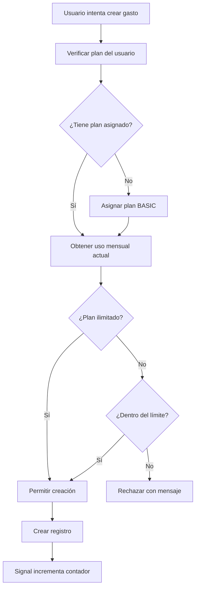

# 📊 Sistema de Límites Mensuales por Plan

Este documento explica cómo funciona el nuevo sistema de límites mensuales para gastos e ingresos basado en los planes de suscripción de los usuarios.

## 🎯 **Resumen del Sistema**

- **Límites Mensuales**: Cada usuario tiene límites que se reinician automáticamente cada mes
- **Plan Básico por Defecto**: Todos los usuarios tienen plan básico automáticamente (100 gastos + 50 ingresos/mes)
- **Planes Premium/Business**: Registros ilimitados por mes
- **Conteo Automático**: Los límites se actualizan automáticamente con signals de Django

## 📋 **Planes y Límites**

| Plan | Gastos/Mes | Ingresos/Mes | Precio |
|------|------------|--------------|--------|
| **BASIC** | 100 | 50 | Gratis |
| **PREMIUM** | ∞ Ilimitado | ∞ Ilimitado | $5/mes |
| **BUSINESS** | ∞ Ilimitado | ∞ Ilimitado | $20/mes |

## 🏗️ **Arquitectura del Sistema**

### **Modelos Principales**

#### 1. **User** (users/models.py)
```python
class User(models.Model):
    subscription_plan = models.ForeignKey(SubscriptionPlan, ...)
    
    def can_add_expense(self):
        """Verifica si puede agregar gasto este mes"""
        
    def can_add_income(self):
        """Verifica si puede agregar ingreso este mes"""
        
    def get_usage_summary(self):
        """Obtiene resumen de uso mensual"""
```

#### 2. **MonthlyUsage** (users/models.py)
```python
class MonthlyUsage(models.Model):
    user = models.ForeignKey(User, ...)
    year = models.PositiveIntegerField()
    month = models.PositiveIntegerField()
    expenses_count = models.PositiveIntegerField(default=0)
    incomes_count = models.PositiveIntegerField(default=0)
```

#### 3. **SubscriptionPlan** (users/models.py)
```python
class SubscriptionPlan(models.Model):
    name = models.CharField(choices=[('BASIC', 'Básico'), ...])
    unlimited_records = models.BooleanField(default=False)
```

### **Configuración de Límites**

Los límites se definen en `users/plan_limits.py`:

```python
PLAN_LIMITS = {
    'BASIC': {
        'max_expenses': 100,   # 100 gastos por mes
        'max_incomes': 50,     # 50 ingresos por mes
    },
    'PREMIUM': {
        'max_expenses': None,  # Ilimitado
        'max_incomes': None,   # Ilimitado
    },
    'BUSINESS': {
        'max_expenses': None,  # Ilimitado
        'max_incomes': None,   # Ilimitado
    }
}
```

## 🔄 **Flujo de Funcionamiento**

### **1. Creación de Gasto/Ingreso**



### **2. Reinicio Mensual Automático**

- **No requiere proceso manual**
- Cada mes nuevo = nuevo registro `MonthlyUsage`
- Los contadores empiezan en 0 automáticamente

### **3. Validación en Tiempo Real**

```python
# Ejemplo de uso
user = User.objects.get(external_id="123")

# Verificar límites antes de crear
can_add, message = user.can_add_expense()
if can_add:
    # Crear gasto (signals se encargan del conteo)
    expense = Expense.objects.create(
        user=user,
        amount=100,
        currency='USD',
        # ... otros campos
    )
    print("✅ Gasto creado exitosamente")
else:
    print(f"❌ {message}")
    # "Has alcanzado el límite de 100 gastos mensuales del plan básico..."
```

## 🛠️ **Comandos de Gestión**

### **Inicializar Uso Mensual**

```bash
# Ver qué se haría (recomendado primero)
python manage.py initialize_monthly_usage --dry-run

# Inicializar mes actual para todos los usuarios
python manage.py initialize_monthly_usage

# Inicializar mes específico
python manage.py initialize_monthly_usage --year 2025 --month 1

# Inicializar solo un usuario
python manage.py initialize_monthly_usage --user-id "telegram_123456"
```

### **Verificar Uso de un Usuario**

```python
# En Django shell
from users.models import User

user = User.objects.get(external_id="telegram_123456")
summary = user.get_usage_summary()
print(summary)

# Output:
# {
#   'period': '2025-01',
#   'expenses': {'used': 95, 'limit': 100, 'remaining': 5},
#   'incomes': {'used': 30, 'limit': 50, 'remaining': 20}
# }
```

## 🔧 **Instalación y Configuración**

### **1. Ejecutar Migraciones**

```bash
# Crear migraciones para el nuevo modelo MonthlyUsage
python manage.py makemigrations users

# Aplicar migraciones
python manage.py migrate
```

### **2. Inicializar Datos Existentes**

```bash
# Primero hacer dry-run para ver qué cambiaría
python manage.py initialize_monthly_usage --dry-run

# Si todo se ve bien, ejecutar realmente
python manage.py initialize_monthly_usage
```

### **3. Verificar Funcionamiento**

```python
# En Django shell
from users.models import User, MonthlyUsage

# Verificar que los usuarios tengan plan básico
users_without_plan = User.objects.filter(subscription_plan__isnull=True)
print(f"Usuarios sin plan: {users_without_plan.count()}")

# Verificar registros mensuales
current_month_usage = MonthlyUsage.objects.filter(
    year=2025, month=1
).count()
print(f"Registros de uso mensual: {current_month_usage}")
```

## 📈 **Monitoreo y Métricas**

### **Consultas Útiles**

```python
from users.models import User, MonthlyUsage
from django.utils import timezone

# Usuarios que han alcanzado el límite este mes
now = timezone.now()
users_at_limit = MonthlyUsage.objects.filter(
    year=now.year,
    month=now.month,
    expenses_count__gte=100
).select_related('user')

# Uso promedio por plan
from django.db.models import Avg
usage_by_plan = MonthlyUsage.objects.filter(
    year=now.year,
    month=now.month
).select_related('user__subscription_plan').values(
    'user__subscription_plan__name'
).annotate(
    avg_expenses=Avg('expenses_count'),
    avg_incomes=Avg('incomes_count')
)
```

## 🚨 **Mensajes de Error**

Cuando un usuario alcanza el límite, recibe mensajes claros:

```
❌ Has alcanzado el límite de 100 gastos mensuales del plan básico. 
   Actualiza a Premium para registros ilimitados y más funciones. 
   El límite se reinicia el próximo mes.
```

```
❌ Has alcanzado el límite de 50 ingresos mensuales del plan básico. 
   Actualiza a Premium para registros ilimitados y más funciones. 
   El límite se reinicia el próximo mes.
```

## 🔄 **Integración con Bots**

El sistema funciona automáticamente con:

- **Telegram Bot** (`telegrambot/tools.py`)
- **WhatsApp Bot** (`whatsappbot/services.py`)
- **API REST** (`income/serializers.py`, `expenses/serializers.py`)

Todas las validaciones se ejecutan antes de crear registros.

## 🐛 **Troubleshooting**

### **Problema: Usuario sin plan asignado**
```python
# Solución automática en el código
user.assign_basic_plan_if_none()
```

### **Problema: Contadores desactualizados**
```bash
# Reinicializar uso mensual
python manage.py initialize_monthly_usage --user-id "problema_user_id"
```

### **Problema: Imports circulares**
- ✅ **Solucionado**: MonthlyUsage está en `users/models.py`
- ✅ **Imports dinámicos**: Se usan donde es necesario

## 📊 **Ventajas del Sistema**

- ✅ **Reinicio Automático**: Sin procesos manuales cada mes
- ✅ **Performance**: Consultas rápidas con índices optimizados
- ✅ **Escalabilidad**: Funciona con millones de usuarios
- ✅ **Flexibilidad**: Fácil cambiar límites sin tocar código
- ✅ **Transparencia**: Mensajes claros sobre límites y reinicio
- ✅ **Histórico**: Mantiene registro de uso por mes
- ✅ **Robustez**: Maneja eliminaciones y casos edge

## 🎯 **Próximas Mejoras**

- [ ] Dashboard de administración para ver uso por usuario
- [ ] Notificaciones cuando usuarios se acercan al límite
- [ ] Métricas de conversión de básico a premium
- [ ] API endpoint para consultar uso mensual
- [ ] Alertas automáticas para usuarios que alcanzan límites

---

**Desarrollado para CashBot API** 🤖💰
