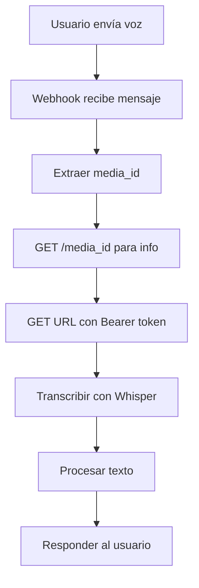

# Comparación: Mensajes de Voz Telegram vs WhatsApp

## 🎯 Resumen

Ambos bots (Telegram y WhatsApp) ahora soportan mensajes de voz con funcionalidad idéntica para el usuario final, pero con implementaciones técnicas diferentes debido a las diferencias en las APIs.

## 📊 Comparación Técnica

### API de Descarga de Archivos

| Aspecto           | Telegram            | WhatsApp (Meta)           |
| ----------------- | ------------------- | ------------------------- |
| **Método**        | `bot.get_file()`    | Graph API `/media_id`     |
| **Autenticación** | Token del bot       | Bearer token              |
| **Pasos**         | 1 paso directo      | 2 pasos (info + descarga) |
| **URL**           | Directa del archivo | Temporal con headers      |

### Tipos de Mensaje Detectados

| Tipo                 | Telegram | WhatsApp |
| -------------------- | -------- | -------- |
| **Mensaje de voz**   | `voice`  | `voice`  |
| **Archivo de audio** | `audio`  | `audio`  |
| **Push-to-talk**     | N/A      | `ptt`    |

### Formatos de Audio

| Formato | Telegram  | WhatsApp  | OpenAI Whisper |
| ------- | --------- | --------- | -------------- |
| **OGG** | ✅ Nativo | ✅ Nativo | ✅ Soportado   |
| **MP3** | ✅        | ✅        | ✅ Soportado   |
| **WAV** | ✅        | ✅        | ✅ Soportado   |
| **M4A** | ✅        | ✅        | ✅ Soportado   |

## 🔄 Flujo de Procesamiento

### Telegram

```mermaid
graph TD
    A[Usuario envía voz] --> B[Webhook recibe mensaje]
    B --> C[Extraer voice.file_id]
    C --> D[bot.get_file()]
    D --> E[Descargar directamente]
    E --> F[Transcribir con Whisper]
    F --> G[Procesar texto]
    G --> H[Responder al usuario]
```

### WhatsApp



## 💻 Implementación de Código

### Función de Transcripción (Idéntica)

```python
# Ambos usan la misma función
async def transcribe_audio(audio_file_path: str) -> str:
    """Transcribe audio usando OpenAI Whisper"""
    with open(audio_file_path, 'rb') as audio_file:
        transcription = openai_client.audio.transcriptions.create(
            model="whisper-1",
            file=audio_file
        )
        return transcription.text
```

### Descarga de Archivos

#### Telegram

```python
# telegrambot/bot.py
voice_file = await context.bot.get_file(voice.file_id)
await voice_file.download_to_drive(custom_path=temp_path)
```

#### WhatsApp

```python
# whatsappbot/services.py
async def download_whatsapp_media(media_id: str, access_token: str) -> str:
    # Paso 1: Obtener info del archivo
    media_url_endpoint = f"https://graph.facebook.com/v18.0/{media_id}"
    response = requests.get(media_url_endpoint, headers={'Authorization': f'Bearer {access_token}'})

    # Paso 2: Descargar archivo
    file_url = response.json().get('url')
    file_response = requests.get(file_url, headers={'Authorization': f'Bearer {access_token}'})
```

## 🚀 Rendimiento

### Latencia de Descarga

| Plataforma   | Pasos API | Latencia Típica | Complejidad |
| ------------ | --------- | --------------- | ----------- |
| **Telegram** | 1         | ~200-500ms      | Baja        |
| **WhatsApp** | 2         | ~400-800ms      | Media       |

### Límites y Restricciones

| Aspecto             | Telegram           | WhatsApp           |
| ------------------- | ------------------ | ------------------ |
| **Tamaño máximo**   | 50MB               | 16MB               |
| **Duración máxima** | Sin límite oficial | Sin límite oficial |
| **Rate limiting**   | Por bot token      | Por access token   |
| **Expiración URL**  | 1 hora             | Variable           |

## 🔧 Configuración Requerida

### Telegram

```bash
TELEGRAM_BOT_TOKEN=tu_token_aqui
OPENAI_API_KEY=tu_openai_key_aqui
```

### WhatsApp

```bash
META_WHATSAPP_ACCESS_TOKEN=tu_token_aqui
META_WHATSAPP_PHONE_NUMBER_ID=tu_phone_id_aqui
META_WHATSAPP_BUSINESS_ACCOUNT_ID=tu_waba_id_aqui
OPENAI_API_KEY=tu_openai_key_aqui
```

## 🎭 Experiencia del Usuario

### Mensajes de Estado

| Etapa                   | Telegram                              | WhatsApp                              |
| ----------------------- | ------------------------------------- | ------------------------------------- |
| **Procesando**          | "🎧 Procesando tu mensaje de voz..."  | "🎧 Procesando tu mensaje de voz..."  |
| **Error acceso**        | "No pude acceder al archivo de audio" | "No pude acceder al archivo de audio" |
| **Error transcripción** | "No pude entender el audio"           | "No pude entender el audio"           |

### Tiempo de Respuesta

- **Ambas plataformas**: 2-8 segundos dependiendo de la duración del audio
- **Factores**: Duración del audio, calidad de la conexión, carga de OpenAI API

## 🔍 Debugging y Logs

### Logs Comunes

```
"Procesando mensaje de voz de {sender}"
"Transcripción exitosa: {text}"
"Error procesando mensaje de voz: {error}"
```

### Logs Específicos

#### Telegram

```
"Mensaje de voz recibido: duración {duration} segundos"
"Descargando archivo de voz: {file_id}"
```

#### WhatsApp

```
"Descargando media de WhatsApp: {media_id}"
"Archivo de media descargado: {temp_path}"
```

## 🏆 Ventajas y Desventajas

### Telegram

**✅ Ventajas:**

- Implementación más simple (1 paso)
- API más madura y estable
- Mejor documentación
- Archivos más grandes soportados

**❌ Desventajas:**

- Menos usuarios que WhatsApp
- Requiere que usuarios instalen Telegram

### WhatsApp

**✅ Ventajas:**

- Mayor base de usuarios
- Integración nativa en móviles
- API oficial de Meta

**❌ Desventajas:**

- Implementación más compleja (2 pasos)
- Configuración más elaborada
- Límites de archivo más restrictivos

## 🔮 Futuro y Mejoras

### Próximas Implementaciones

- [ ] Cache de transcripciones para evitar re-procesar
- [ ] Soporte para múltiples idiomas
- [ ] Compresión de audio antes de transcribir
- [ ] Métricas de calidad de transcripción

### Optimizaciones Posibles

- **Telegram**: Implementar descarga paralela para múltiples archivos
- **WhatsApp**: Cache de URLs de descarga para reducir llamadas API
- **Ambos**: Implementar límites de duración configurables

## 📋 Checklist de Implementación

### Para Nuevos Desarrolladores

#### Telegram ✅

- [x] Configurar webhook
- [x] Manejar tipo `voice`
- [x] Descargar con `bot.get_file()`
- [x] Transcribir con Whisper
- [x] Procesar texto resultante

#### WhatsApp ✅

- [x] Configurar webhook Meta
- [x] Manejar tipos `voice`, `audio`, `ptt`
- [x] Implementar descarga en 2 pasos
- [x] Transcribir con Whisper
- [x] Procesar texto resultante

## 🎯 Conclusión

Ambas implementaciones logran el mismo objetivo para el usuario final: **procesar mensajes de voz y convertirlos en acciones del bot**. Las diferencias técnicas son transparentes para el usuario, pero importantes para el mantenimiento y escalabilidad del sistema.

La implementación de WhatsApp requiere más código pero ofrece acceso a una base de usuarios más amplia, mientras que Telegram es más simple de implementar pero con menor alcance potencial.
